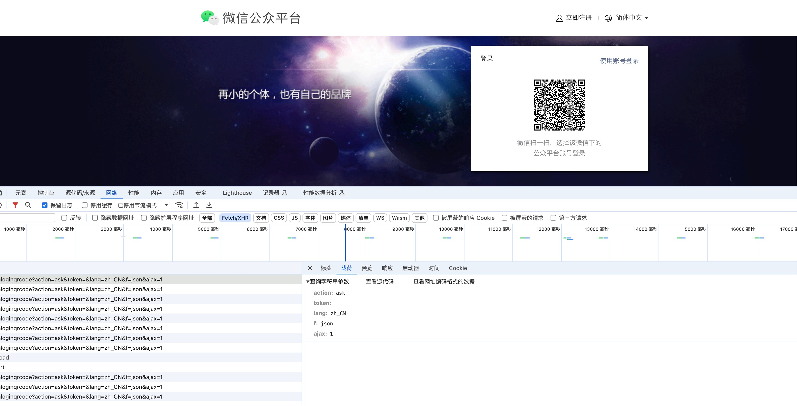
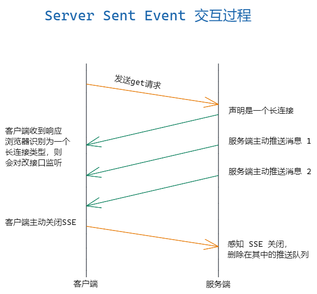

## 起点

- 之前在开发游戏社区的时候，需要实现站内信和 AIGC 创作的功能，因此需要去评估多种通信方案。
- 在使用 ChatGPT 和开发 AIGC 相关功能时，通过抓包等工具和相关文献内容，了解到 ChatGPT 使用的是 SSE，之前对 SSE 有一点了解，但是没有具体了解过。

## 消息推送

之前就职的每日互动（个推）也是有消息推送的业务，然后我所在的部门泰尔卓信负责的推必安则是负责消息推送内容安全的内容，这些是移动端消息推送。

在 web 端的消息推送和移动端消息推送不一样，主要是站内信、聊天消息、管理端审核内容信息等提醒。

## Web 端消息推送方案

### 轮询方案

轮询是实现前端消息推送方案中最简单的一种，目前一共有两种方式：短轮询、长轮询。

#### 短轮询

指定时间间隔，由浏览器向服务端发出 HTTP 请求，服务器实时返回未读消息数据给客户端，浏览器再做渲染显示。

一个简单的 JS 定时器就可以搞定，每秒钟请求一次未读消息数接口，返回的数据展示即可。

```js
setInterval(() => {
  // 方法请求
  messageCount().then((res) => {
    if (res.code === 200) {
      this.messageCount = res.data;
    }
  });
}, 1000);
```

短轮询实现非常简单，缺点也是显而易见，由于推送数据并不会频繁变更，无论后端此时是否有新的消息产生，客户端都会进行请求，势必会对服务端造成很大压力，浪费带宽和服务器资源。
该方案适用于短期或者临时消息推送需求，比如扫码登录，微信公众号、掘金、支付网关等待和其他 App 的扫码登录，大部分都是采用的短轮询。

我开发的游戏社区小程序&App 扫码登录功能也是涉及了短轮询。

#### 长轮询

长轮询是对短轮询的一种改进版本，客户端发送 HTTP 给服务器之后，看有没有新消息，如果没有新消息，就一直等待,当有新消息的时候，才会返回给客户端，在尽可能减少对服务器资源浪费的同时，保证消息的相对实时性。

```js
//服务器
let express = require("express");
let app = express();
app.use(express.static("www"));
app.get("/", (req, res) => {
  let timer = setInterval(() => {
    let seconds = new Date().getSeconds();
    if (seconds == 50) {
      res.send(Date.now());
      clearInterval(timer);
    }
  }, 1000);
});
app.listen(3000);
```

web 端：

```js
function send() {
  let xhr = new XMLHttpRequest();
  xhr.open("GET", "http://localhost:3000", true);
  xhr.onreadystatechange = function () {
    if (xhr.readyState == 4 && xhr.status == 200) {
      document.querySelector("#root").innerHTML = xhr.responseText;
      send();
    }
  };
  xhr.send();
}
send();
```

长轮询相比于短轮询在性能上提升了很多，但依然会产生较多的请求，这是它的一点不完美的地方。


### iframe 流

iframe 流就是在页面中插入一个隐藏的\<iframe>标签，通过在 src 中请求消息数量 API 接口，由此在服务端和客户端之间创建一条长连接，服务端持续向 iframe 传输数据。实现方式只需要 iframe 即可。

```html
<iframe src="/iframe/message" style="display:none"></iframe>
```

```js
const express = require("express");
const app = express();
app.use(express.static("www"));
app.get("/iframe/message", (req, res) => {
  setInterval(() => {
    res.write(`
			<script type="text/javascript">
			parent.document.getElementById('root').innerHTML = "${Date.now()}";
			</script>
			`);
  }, 1000);
});
app.listen(3000);
```

但是这种方案会导致浏览器一直处于 loading 状态，对应的服务器开销很大，及其不友好。

### Websocket

Websocket 是常见的实现实时消息推送的方式，是 HTML5 提供的一种浏览器与服务器进行全双工通讯的网络技术，属于应用层协议，它基于 TCP 传输协议，并复用 HTTP 的握手通道。
优势是支持双向通信，实时性更强。较少的控制开销。连接创建后，客户端、服务端进行数据交换时，协议控制的数据包头部较小。

服务端：

```js
const express = require("express");
const http = require("http");
const Ws = require("ws").Server;
const app = express();
const server = http.createServer(app);
server.listen(3000);
app.use(express.static("www"));

let wsServer = new Ws({ server });
wsServer.on("connection", (socket) => {
  console.log("连接成功");
  // 监听客户端发过来的消息
  socket.on("message", (msg) => {
    console.log("客户端发送过来的消息：" + msg);
    // 服务器给客户端发送消息
    socket.send("服务器说：你好客户端");
  });
});
```

Web 端：

```js
let ws = new WebSocket("ws://127.0.0.1:3000");
ws.onopen = () => {
  ws.send("hello server");
};
ws.onmessage = (ev) => {
  console.log(ev.data);
};
```

### SSE（EventSource）

SSE 是 HTML5 中的 EventSource API，通过服务器推送实现实时通信。客户端从服务端订阅一条“流”，之后服务端可以发送消息给客户端直到服务端或者客户端关闭该“流”，所以 EventSource 也叫作 SSE(server-sent-event)，用于在客户端和服务器之间建立持久的、单向的通信连接。
它基于 HTTP 协议，通过服务器推送的方式向客户端发送实时事件通知。客户端通过添加事件侦听器来捕获事件并执行相应的操作。



与 WebSocket 相比，EventSource 提供了一种简单而可靠的单向通信机制（服务器->客户端），实现简单，适用于许多实时应用场景。
其请求头是 Content-Type:text/event-stream。

服务端：
```js
const express = require('express');
const app = express();
const http = require('http');
const server = http.createServer(app);

app.get('/api/sse', (req, res) => {
  res.writeHead(200, {
    'Content-Type': 'text/event-stream',
    'Cache-Control': 'no-cache',
    'Connection': 'keep-alive'
  });

  const interval = setInterval(() => {
    const time = new Date().toISOString();
    const data = `data: ${time}\n\n`;
    res.write(data);
  }, 1000);

  req.on('close', () => {
    clearInterval(interval);
    res.end();
  });
});

server.listen(3000, () => {
  console.log('Server is running on port 3000');
});
```

客户端：

```js
// 通过 new EventSource 开启 SSE
const source = new EventSource(`http://127.0.0.1:3000/api/sse`);
// 监听 message 事件
source.onmessage = (event) => {
  // 挂到载体上面
  app.innerHTML += `${event.data} \n`;
};
```

ChatGPT 就是采用的 SSE，对于需要长时间等待响应的对话场景，ChatGPT 采用了一种巧妙的策略：它会将已经计算出的数据“推送”给用户，并利用 SSE 技术在计算过程中持续返回数据。这样做的好处是可以避免用户因等待时间过长而选择关闭页面。

兼容 IE 方案：使用 event-source-polyfill

##### WebSocket 与 SSE 的优缺点：
- SSE
    - 优点
        - 简单易用：EventSource 使用简单，基于标准的 HTTP 协议，无需复杂的握手过程。
        - 自动重连：EventSource 具有内置的重连机制，确保连接中断后自动重新连接。
        - 轻量级：EventSource 使用长轮询机制，消耗的资源相对较少，适合低带宽环境。
        - 跨域支持：EventSource 允许在跨域环境下进行通信，通过适当的响应头授权来自不同域的客户端连接。
    - 缺点
        - 单向通信：EventSource 只支持服务器向客户端的单向通信，无法实现客户端向服务器的实时交互。
        - 较低的浏览器支持：尽管现代浏览器广泛支持 EventSource，但在一些较旧的浏览器中可能不完全支持。
- WebSocket
    - 优点
        - 双向通信：WebSocket 支持全双工通信，客户端和服务器可以在同一连接上进行双向数据交换。
        - 实时性和效率：WebSocket 具有低延迟和高效性能，适用于需要快速、实时响应的应用。
        - 大规模应用：WebSocket 适用于复杂的、大规模的实时应用，如在线游戏、协同编辑等。
    - 缺点
        - 复杂性：WebSocket 协议的握手过程相对复杂，需要服务器和客户端实现特定的协议逻辑。
        - 难以穿越防火墙和代理服务器：WebSocket 的特殊协议可能会受到防火墙和代理服务器的限制。

### MQTT

MQTT 是一种基于发布/订阅（publish/subscribe）模式的轻量级通讯协议，通过订阅相应的主题来获取消息，是物联网中的一个标准传输协议。
该协议将消息的发布者与订阅者进行分离，因此可以在不可靠的网络环境中，为远程连接的设备提供可靠的消息服务，使用方式与传统的 MQ 有点类似。
TCP 协议位于传输层，MQTT 协议位于应用层，MQTT 协议构建于 TCP/IP 协议上，也就是说只要支持 TCP/IP 协议栈的地方，都可以使用 MQTT 协议。

#### 使用 RabbitMQ 实现消息推送

1. 开启 mqtt 协议
   默认情况下 RabbitMQ 是不开启 MQTT 协议的，所以需要手动的开启相关的插件，而 RabbitMQ 的 MQTT 协议分为两种。

- 第一种 rabbitmq_mqtt 提供与后端服务交互使用，对应端口 1883。

```bash
rabbitmq-plugins enable rabbitmq_mqtt
```

- 第二种 rabbitmq_web_mqtt 提供与前端交互使用，对应端口 15675。

```
rabbitmq-plugins enable rabbitmq_web_mqtt
```

2. 服务端消息发送

```bash
npm install express mqtt
```

服务端

```js
const express = require("express");
const mqtt = require("mqtt");
const app = express();
const port = 3000;

// RabbitMQ MQTT 服务器配置
const mqttServer = "mqtt://localhost:1883"; // 默认端口是 1883
const mqttClientId = "express_app_mqtt_client";
const mqttTopic = "my/topic";

// 创建 MQTT 客户端
const client = mqtt.connect(mqttServer, {
  clientId: mqttClientId,
  clean: true,
});

// 处理连接
client.on("connect", () => {
  console.log("MQTT client connected");
  // 订阅主题
  client.subscribe(mqttTopic, (err) => {
    if (!err) {
      console.log("Subscribed to topic:", mqttTopic);
    }
  });
});

// 处理接收到的消息
client.on("message", (topic, message) => {
  // 在这里处理接收到的消息
  console.log("Received message on topic:", topic);
  console.log("Message:", message.toString());
});

// Express 路由示例
app.get("/", (req, res) => {
  res.send("Hello World!");
});

// 示例：通过 MQTT 发布消息
app.get("/publish", (req, res) => {
  const message = "Hello from Express app!";
  client.publish(mqttTopic, message);
  res.send(`Message "${message}" published to ${mqttTopic}`);
});

// 启动 Express 服务器
app.listen(port, () => {
  console.log(`Express app listening at http://localhost:${port}`);
});
```

客户端

```js
// mqtt协议rabbitmq服务
var brokerIp = location.hostname;
// mqtt协议端口号
var port = 15675;
// 接受推送消息的主题
var topic = "my/topic";
// mqtt连接
client = new Paho.MQTT.Client(
  brokerIp,
  port,
  "/public",
  "express_app_mqtt_client"
);
var options = {
  timeout: 3, //超时时间
  keepAliveInterval: 30, //心跳时间
  onSuccess: function () {
    console.log("连接成功~");
    client.subscribe(topic, { qos: 1 });
  },
  onFailure: function (message) {
    console.log("连接失败~" + message.errorMessage);
  },
};
// 考虑到https的情况
if (location.protocol == "https:") {
  options.useSSL = true;
}
client.connect(options);
console.log("已经连接到" + brokerIp + ":" + port);
// 连接断开事件
client.onConnectionLost = function (responseObject) {
  console.log("失去连接 - " + responseObject.errorMessage);
};
// 接收消息事件
client.onMessageArrived = function (message) {
  console.log(
    "接受主题： " +
      message.destinationName +
      "的消息： " +
      message.payloadString
  );
  $("#arrivedDiv").append("<br/>" + message.payloadString);
  var count = $("#count").text();
  count = Number(count) + 1;
  $("#count").text(count);
};
// 推送给指定主题
function sendMessage() {
  var a = $("#message").val();
  if (client.isConnected()) {
    var message = new Paho.MQTT.Message(a);
    message.destinationName = topic;
    client.send(message);
  }
}
```

### Socket.IO

在 Node 中，有一个 WebSocket 库 Socket.IO，包括了客户端的 js 和服务器端的 nodejs，它会自动根据浏览器从 WebSocket、AJAX 长轮询、Iframe 流等等各种方式中选择最佳的方式来实现网络实时应用，非常方便和人性化。
服务端：

```js
//服务端
const express = require("express");
const http = require("http");
const app = express();
const server = http.createServer(app);
const io = require("socket.io")(server);
server.listen(3000);
app.use(express.static("www"));

// 监听客户端的连接事件
io.on("connection", (socket) => {
  socket.on("message", (msg) => {
    console.log("接受到客户端发过来的消息：" + msg);
    socket.send("服务器说：" + msg);
  });
});
```

Web 端：

```html
<script src="/socket/socket.io.js"></script>
<script>
  let socket = io.connect("http://localhost:3000/");
  socket.on("connect", () => {
    console.log("连接成功");
    socket.emit("message", "hello");
  });

  socket.on("message", (msg) => {
    console.log(msg);
  });

  // 断开连接
  socket.on("disconnect", () => {
    console.log("断开连接");
  });

// 全局广播 
io.emit('message','全局广播'); 
// 向除了自己外的所有人广播
socket.broadcast.emit('message', msg);
</script>
```

## 总结

|方案|优点|缺点|
|---|---|---|
|短轮询|简单、易理解、易实现|实时性太差，无效请求太多，频繁建立连接太耗费资源|
|长轮询|减少了无效请求|挂起请求会导致资源浪费|
|iframe 流|简单、易理解、易实现|维护一个长连接会增加开销，效果太差（图标会不停旋转）|
|WebSocket|实时性高，有效请求多,性能高、开销小|实现复杂|
|SSE|简单、易实现，功能丰富|不支持双向通信|
|MQTT|成熟稳定，轻量级|实现复杂|

