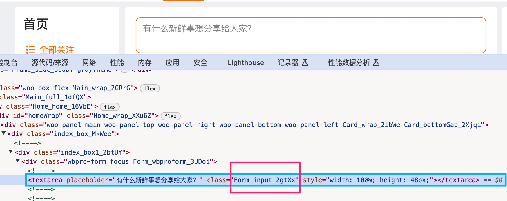
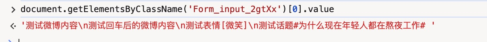
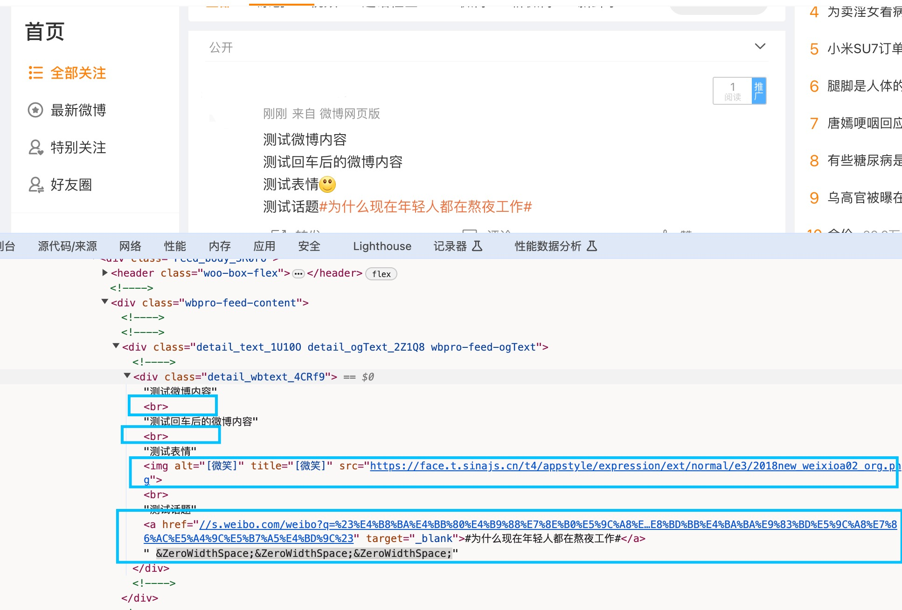

# 实现简单的富文本输入框

## 富文本编辑器历程
首先我们需要了解富文本编辑器的历程。
富文本编辑器按发展历程而言，分为 L0、L1、L2、L3三个阶段，每个阶段都比上一个阶段的定制化程度更高，浏览器兼容问题更少，同时开发难度也更大。
### L0级富文本编辑器
早期时代网页的富文本能力主要依靠对DOM的contenteditable属性来渲染样式，以及依赖于浏览器的document.execCommand()方法来修改富文本内容的样式，仅提供了有限的命令，实现最简单的功能，如粗体、斜体、文字颜色等等。<br>
- 可编辑内容依赖 `contenteditable` API；
- 编辑内容使用 `document.execCommand` API。

- 优点
    - 依赖于html原生的编辑能力，实现难度较低
    - 对性能要求不高，操作起来比较流畅
- 缺点
    - 不同浏览器对于document.execCommand()方法实现方法的不同，会导致生成的html内容会不同，兼容性较差
        - 比如实现粗体效果，有些浏览器可能通过\<b>标签实现，有些浏览器可能通过\<strong>标签实现
        - 删除内容会导致冗余的html标签内容，如删除\<strong>文本\<strong>内容中的文本，会遗留\<strong>\<strong>标签
        - 不能实现协同编辑功能

L0级富文本编辑器代表编辑器：Ueditor、KindEditor、summernote、CKEditor（早期版本）等。<br>

### L1富文本编辑器
由于L0级富文本编辑器存在兼容的问题，且对文档样式的要求越来越高，L0级富文本编辑器无法满足需求，L1阶段的编辑器应运而生。<br>
L1级依然使用了L0级的视线原理，通过DOM的contenteditable属性来渲染样式，不过L1级是将富文本内容抽象成数据模型，通过数据模型来管理编辑器的内容以及选区状态等，并采用**自定义execCommand**的方案，可以实现更加丰富的富文本功能。
- 优点
    - 通过抽离数据模型来管理富文本内容及状态，能够避免此前阶段同步浏览器之间对不同样式实现的差异。
    - 通过内部数据模型实现在写协作的功能。
    - 解决了富文本中脏数据、复杂功能难以实现的问题。
- 缺点
    - 实现技术门槛比较高。
    - 内部数据模型的实现依赖于对DOM的变更监听来管理数据，如存在未知操作可能会导致数据模型的错乱从而影响编辑器的功能。
    - 相比 L0 阶段，引进了一些组合输入问题，依然拥有 `contenteditable` 遗留问题，比如光标的兼容性问题等。

L1级编辑器代表编辑器：Quill、Draft.js、CKEditor（新版）等。

### L2级编辑器
为了解决contenteditable编辑不可控的问题，以GoogleDocs为代表的编辑器通过**自研排版引擎** 步入了L2阶段，实现了更好的实现富文本的功能。<br>
它完全不依赖contenteditable，包括选区、光标等，都是是自己绘制的，自己实现了一个基于元素和绝对定位的排版引擎，基本上脱离了浏览器自身的大部分排版规则。
- 优点
    - 所有浏览器无论做什么操作进行选区的选中，都能够保持一致性。
    - 不会有光标的兼容性问题。
    - 不依赖于浏览器大部分排版规则。
    - 可实现分页、标尺、脚注等高级功能。
- 缺点
    - 那肯定是代码功能更难写了！

## 简单的富文本编辑器-富文本输入框
我们先来实现简单的富文本输入框，富文本输入框的主要应用场景是评论、动态等短文字的内容输入，比如微博、掘金沸点的输入框和评论模块都是富文本输入框。
首先我们来分析一下先来分析微博和掘金沸点的实现方式。
### 微博实现方式
打开控制台，可以看到微博的代码，在代码中可以看到微博的实现方式是textarea。



接下来输入内容，包括文字、表情、话题等，然后从控制台中获取并输出实际的内容。


我们从控制台里获取在textarea输入框里的内容如下：


可以看到，输入内容和表情都是文本内容，表情由[]包住，选择话题后显示的也是#文本#的形式，回车则是用\n表示。<br>

而在发布微博后，我们可以在控制台代码中看到，\n都转换为\<br>，话题转为链接，表情则转为img图片标签。



综合以上来看，微博的输入框是基于Textarea实现，输入内容显示均为文本内容，通过转换函数将指定格式的内容转换为对应的内容。

优缺点：
- 优点：
    - 不需要单独开发编辑器组件。
    - 只需要提供转换函数，就可以根据输入的内容按照规则进行转换。
- 缺点：
    - 只能显示纯文本内容，不能显示非纯文本的内容，比如表情、超话等内容只能以纯文本形式展示。
    - 如果没有输入空格或其他间隔符，或者没有按照微博指定格式输入，就会导致输入的内容无法正常解析转换，比如链接、超话、提及等内容。

### 掘金沸点的实现方式
打开控制台，可以看到掘金沸点的代码，在代码中可以看到掘金的实现方式是contenteditable="true"，也就是LO、L1编辑器的实现方式。<br>
contenteditable属性可以指定元素内容是否可编辑。

优缺点
- 优点
    - 可以显示大部分样式内容，包括图片、表情、视频等等。
    - 可以根据实际需求，定制化样式。
    - 可以拦截复制的内容并根据其内容进行进一步处理。
    - ......


#### 语法
```html
<*element* contenteditable="true|false">
```
#### 属性值

| 值     | 描述         |
| ----- | ---------- |
| true  | 指定元素是可编辑的  |
| false | 指定元素是不可编辑的 |


## 实现简单的富文本输入框
### contenteditable实现

#### 将div变为可编辑状态
```html
<div class="rich_input" contenteditable="true" spellcheck="false"></div>
```
css样式：
```css
.rich_input{
position: relative;
font-size: 14px;
line-height: 24px;
color:#333;
outline: none;
padding: 5px 12px;
box-sizing: border-box;
white-space: pre-wrap;
word-break: break-all;
border: #888 solid 1px;
border-radius: 5px;
width: 500px;
height: 100px;
overflow: scroll;
}
```

#### 实现placeholder占位内容填充
```html
<div class="rich_input" contenteditable="true" spellcheck="false" placeholder="placeholder"></div>
```
css样式
```css
.rich_input:empty::before{
cursor: text;
content: attr(placeholder);
color: #333;
position: absolute;
top: 5px;
}
```

#### 实现插入文本内容
这里涉及到选区的概念，由于本期只是实现简单的输入和插入功能，不涉及复杂的选区内容，本期暂不做介绍，下期会基于选区做个详细的介绍和说明。

```js
    const addText = (val) =>{
      const selection = window.getSelection();
      if (selection) {
        selection.removeAllRanges();
        // 为空初始化光标
        if (!range.value) {
          editorRef.value.focus();
          range.value = selection.getRangeAt(0);
          }
          range.value.deleteContents();
          range.value.insertNode(range.value.createContextualFragment(val));
          range.value.collapse(false);
          selection.addRange(range.value);
      }
    }
```


最终效果:

<iframe src="https://wty9sky.github.io/simple_editor/" class="w-full h-[300px]"></iframe>

Github代码：
- 源码地址：https://github.com/wty9sky/simple_editor

目前关于简单的富文本输入框就到这里了，更多的功能可以自行实现，下一期来实现简单的富文本编辑器。<br>
