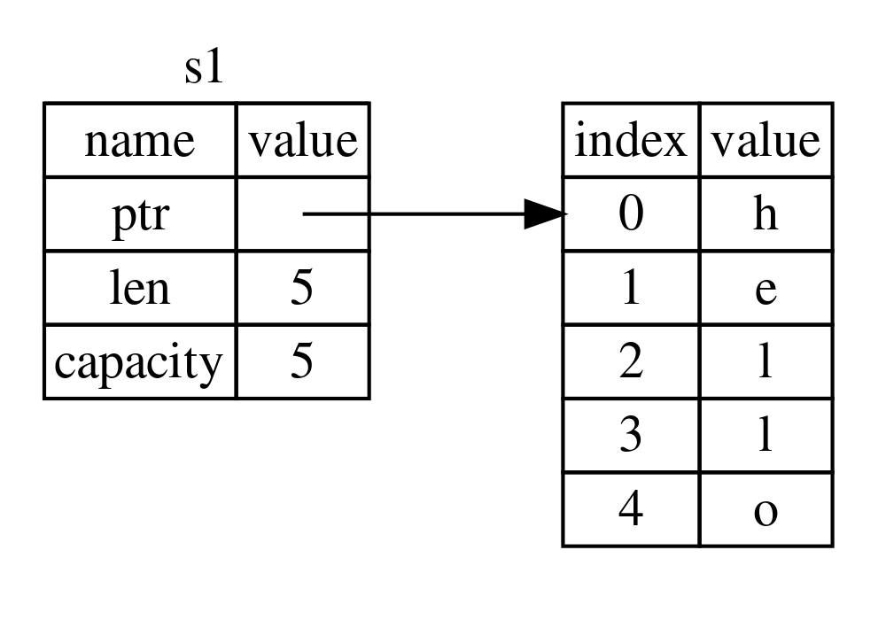
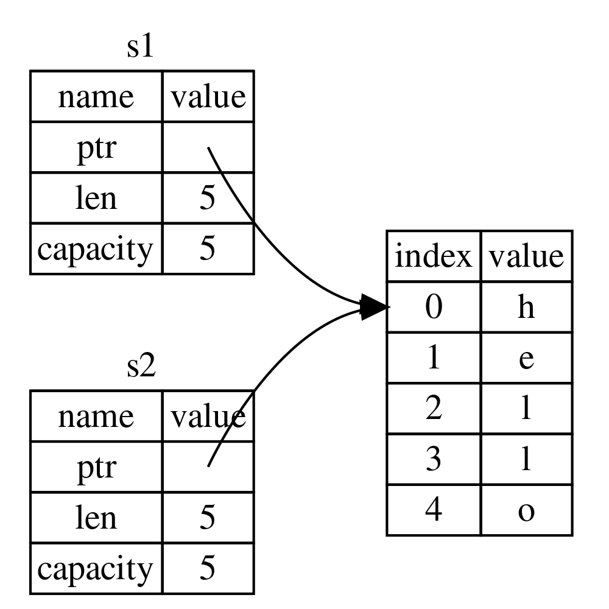
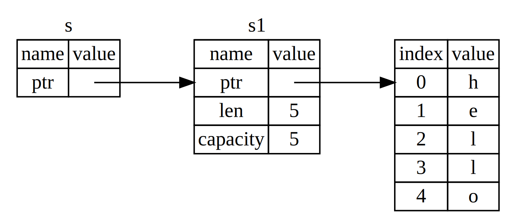

# Rust 进阶

## 所有权

- 所有权是 Rust 最独特的特性，无需垃圾回收（garbage collector）就保证内存安全
- Rust 的核心特性就是所有权
- 所有程序在运行时都必须管理它们使用计算机内存的方式
  - 有些语言有垃圾收集机制，在程序运行时，它们会不断寻找不再使用的内存（C#、Java）
  - 在其他语言中，程序员必须显式的分配和释放内存（C、C++）
- Rust 采用了第三种方式
  - 内存是通过一个所有权系统来管理的，通过所有权系统管理堆存，其中包含一组编译器在编译时检查的规则，编译器在编译时会根据一系列的规则进行检查
  - 当程序运行时，所有权特性不会减慢程序的运行速度（因为都在编译期完成了）
- 所有权以及相关功能：
  - 借用（borrowing）
  - slice
  - Rust 如何在内存中布局数据
- 所有权规则
  - Rust 中的每一个值都有一个 所有者（owner）。
  - 值在任一时刻有且只有一个所有者。
  - 当所有者（变量）离开作用域，这个值将被丢弃。

### Stack and Heap（栈内存和堆内存）

#### 存储数据

- Stack 会按值的接收顺序来存储，按相反的顺序将它们移除（先进后出，后进先出）
  - 添加数据叫做 ”压入栈“
  - 移除数据叫做 ”弹出栈“
  - 所有存储在 Stack 上的数据必须拥有已知的固定的大小
  - 把值压到 Stack 上不叫 ”分配“（因为实际上不需要分配，数据在 Stack 上挨着放就可以了）
- Heap 内存组织性差一些
  - 当你把数据放入 Heap 时，你会请求一定数量的空间
  - 操作系统在 Heap 里找到一块足够大的空间，把它标记为在用，并返回一个指针，也就是这个空间的地址
  - 这个过程叫做在 Heap 上进行分配，有时仅仅称为 ”分配“
- 因为指针是已知固定大小的，可以把指针存放在 Stack 上（也就是说，Stack 存储着 Heap 的指针）
- 编译时大小未知的数据或运行时大小可能发生变化的数据必须存放在 Heap 上
- 如果想要实际的数据，你必须使用指针来定位
- 把数据压到 Stack 上要比在 Heap 上分配快得多
- 因为（入栈时）操作系统无需为存储新数据去搜索内存空间；其位置总是在栈顶。
- 相比之下，在堆上分配内存则需要更多的工作，这是因为操作系统必须首先找到一块足够存放数据的内存空间，并接着做一些记录为下一次分配做准备。

#### 访问数据

- 访问 Stack 中的数据要比访问 Heap 中的数据要快->因为需要通过指针才能找到 Heap 中的数据
- 处理器在处理的数据彼此较近的时候（比如在栈上），比较远的时候（比如在堆上）能更快

#### 函数调用

- 当你的代码调用函数时，值被传入函数（也包括指向 Heap 的指针）
- 函数本地的变量被压到 Stack 上，当函数结束后，这些值会从 Stack 上弹出

### 所有权存在的原因

- 所有权解决的问题
  - 跟踪代码的哪些部分正在使用 Heap 的哪些数据
  - 最小化 Heap 上的重复数据量
  - 可以清理 Heap 上未使用的数据以避免空间不足

### 所有权的规则

- 每个值都有一个变量，这个变量是该值的所有者
- 每个值同时只能有一个所有者
- 当所有者超出作用域（scope）时，该值将被删除

#### 变量作用域（Scope）

- Scope 就是程序中一个有效范围

```rust
fn main() {
//s 不可用
let s = "hello";//s 可用
//可以对 s 进行相关操作
}//s 作用域到此结束，s 不可用
```

#### String 类型

- String 类型比那些基础标量数据类型更复杂
- 基础数据类型存放在 Stack 上，离开作用域就会弹出栈
- 我们现在用一个存储在 Heap 上面的类型，来研究 Rust 是如何回收这些数据的
- String 会在 Heap 上分配，能够存储在编译时未知数量的文本

##### 创建 String 类型的值

- 可以使用 from 函数从字符串字面值创建出 String 类型

```rust
let mut s = String::from("hello");
```

- ::表示 from 是 String 类型下的函数,这类字符串是可以被修改的

```rust
fn main() {
let mut s = String::from("hello");
s.push_str(" word");
println!("{}", s);
}
```

##### 内存与分配

- 字符串字面值在编译时就知道他的内容了，其文本内容直接被硬编码到最终的可执行文件中
- 速度快、高效，是因为其不可变性
- String 类型，为了支持可变性，需要在 Heap 上分配内存来保存编译时未知的文本内容
- 操作系统必须在运行时来请求内存
- 通过调用 String::from 实现
- 当用完 String 后，需要用某种方式把内存返还给操作系统
- 这步，在拥有 GC 的语言中，GC 会跟踪并清理不再使用的内存
- 没有 GC，就需要我们去识别内存何时不再使用，并调用代码将内存空间返还
- 如果忘了，那就是浪费内存
- 如果提前做的，变量就会非法
- 如果做了两次，也是 Bug，必须一次分配对应一次释放
  =>
  Rust 采用了不同的方式：
- 对于某个值来说，当拥有它的变量走出范围时，内存会立即自动的交还给操作系统
- drop 函数，变量走出作用域，Rust 会自动执行这个函数，释放空间

- 变量和数据交互的方式
  - 移动（Move）
  - 克隆（Clone）

##### 移动

- 基本数据类型:
  - 多个变量可以使用同一个数据
  - 整数是已知且固定大小的简单的值，这两个 5 被压到了 Stack 中
  - 基本数据类型不存在什么 浅拷贝、深拷贝，只有引用类型涉及，因为基本数据类型操作都是在 Stack 上进行的

```rust
let x = 5;
let y = x;
```

- String 类型（或者说用到了 Heap 的类型，也叫引用类型）：

```rust
let s1 = String::from("hello");
let s2 = s1;
```

- 一个 String 由 3 部分构成（放在 Stack 中），存放字符串内容的部分在 Heap 上
  - 一个指向存放字符串内容的内存的指针
  - 一个长度（len：表示存放这个字符串所需的字节数）
  - 一个容量 （capacity：指 String 从操作系统中总共获得内存的总字节数）



- 当把 s1 赋给 s2，String 的数据被复制了一份：
- 在 Stack 上复制了一份，指针、长度、容量
- 并没有复制指针所指向的 Heap 数据
  

- 当变量离开作用域时，Rust 会自动调用 drop 函数，并将变量使用的 heap 内存释放
- 当 s1，s2 离开作用域时，它们都会尝试释放相同的内存
- 二次释放（double free）Bug
- 为了保证内存的安全
  - Rust 没有尝试复制被分配的内存（Heap 中的存储内容没有被复制）
  - Rust 让 s1 失效
- 当 s1 离开作用域的时候，Rust 不需要释放任何东西

```rust
fn main() {
let s1 = String::from("hello");
let s2 = s1;
println!("{}", s1);//会报错
}
```

- 这种操作，有点像浅拷贝（复制 Stack 中的索引信息，指向同一个 Heap 内存地址），但是 Rust 后续删除了第一个变量，所以我们叫了一个新名字 移动（Move）
- 另外，这里还隐含了一个设计选择：Rust 永远也不会自动创建数据的 深拷贝（在 Stack 中创建新的索引，在 Heap 中创建新空间存储数据，这个新索引，指向新空间，数据是一样的）。因此，任何 自动 的复制可以被认为对运行时性能影响较小（因为都是 Move，没对 Heap 进行操作）。

##### 克隆（Clone）

- 如果想对 Heap 上的 String 数据进行深度拷贝，而不仅仅是 Stack 上的索引数据，可以使用 Clone 方法

```rust
fn main() {
let s1 = String::from("hello");
let s2 = s1.clone();
println!("{}, {}", s1, s2);
}
```

##### Stack 上的数据进行复制

- Copy 这个 trait（特质） 在编译器中，如果一个类型 impl 了 Copy trait，意味着任何时候，我们可以通过简单的内存拷贝(C 语言的按位拷贝 memcpy)实现该类型的复制，而不会产生任何问题。有点像注解。
- Copy trait，用于像整数这样完全存放在 Stack 上面的类型
- 所有需要分配内存的都不是 Copy trait
- 一些拥有 Copy trait 的类型：
  - 所有整数类型
  - bool
  - char
  - 所有浮点类型
  - 元组（Tuple），如果里面所有字段都是 Copy 的，那这个元组是
    - （i32,i32）是
    - （i32，String）不是

##### 所有权与函数

- 在语义上，将值传递给函数和把值赋给变量是类似的
- 将值传递给函数将发生移动和复制

```rust
fn main() {
let s = String::from("Hello World");//这里声明引用类型，String，
take_ownership(s);//放入函数，发生了移动

        let a = 1;//声明整型
        makes_copy(a);//实际上传入的是a的副本
    }//a:在Stack中的本来数据被drop

    fn take_ownership(some_string: String) {
        println!("{}", some_string);
    }//s:这里Heap中的数据被drop了

    fn makes_copy(some_number: u32) {
        println!("{}", some_number);
    }//a:在Stack中的副本数据被drop
```

##### 返回值与作用域

- 函数在返回值的过程中同样也会发生所有权的转移

```rust
fn main() {
let s1 = gives_ownership(); //返回值的所有权转移给 s1 发生了移动

        let s2 = String::from("hello");

        let s3 = takes_and_gives_back(s2);//s2 所有权移交给这个方法，然后又移交给s3
    }

    fn gives_ownership() -> String {
        let some_string = String::from("hello");
        some_string
    }

    fn takes_and_gives_back(a_string: String) -> String {
        a_string
    }
```

- 一个值赋给其他变量时就会发生移动 -当一个包含 Heap 数据的变量离开作用域时，它的值就会被 drop 函数清理，除非数据所有权移动到另一个变量上了

##### 让函数使用某个值，但不获得所有权

```rust
fn main() {
    let s1 = String::from("hello");
    let (s2, len) = calculate_length(s1);//把s1的所有权移交到，这个方法中的s，然后再返回
    println!("The length of '{}' is {}", s2, len);
}
fn calculate_length(s: String) -> (String, usize) {
    let length = s.len();//这个length是usize类型，基础类型，存储在Stack中
    (s, length)//这里length返回一个副本就可以了
}
```

这种做法，不得不把变量作为参数传入，然后又作为返回值传出，很繁琐

针对这个场景，Rust 有一个特性，叫做 “引用” （Reference）

## 引用和借用

### 引用

```rust
fn main() {
    let s1 = String::from("Hello");

    let len = calculate_length(&s1);

    println!("The length of '{}' is {}", s1, len);
}

fn calculate_length(s: &String) -> usize {
    s.len()
}
```

- 参数的类型是 &String 而不是 String
- &符号就表示引用：允许你引用某些值而不取得其所有权



- s 就是个指针指向了 s1 然后再指向 Heap，这就是引用的原理

### 借用

- 当一个函数使用引用，而不是一个真实的值作为它的参数，我们就管这个行为叫做借用

- 不可以修改借用的数据
- 和变量一样，引用默认也是不可变的

```rust
  fn main() {
  let s1 = String::from("Hello");

      let len = calculate_length(&s1);

      println!("The length of '{}' is {}", s1, len);

}

fn calculate_length(s: &String) -> usize {
s.push_str(",World");//这里会报错
s.len()
}
```

那么我们把引用的变为可变的,就不会报错了

```rust
fn main() {
let mut s1 = String::from("Hello");

    let len = calculate_length(&mut s1);

    println!("The length of '{}' is {}", s1, len);

}

fn calculate_length(s: &mut String) -> usize {
s.push_str(",World");
s.len()
}
```

- 重要的限制
  - 在特定作用域内，对某一块数据，只能有一个可变的引用
    - 这样做的好处就是可以在编译时防止数据竞争
    - 以下三种行为会发生数据竞争：
      - 两个或多个指针同时访问一个数据
      - 至少有一个指针用于写入数据
      - 没有使用任何的机制来同步对数据的访问
  - 不可以同时拥有一个可变引用和一个不变的引用
    - 多个不变的引用是可以的

```rust
fn main() {
let mut s = String::from("Hello");

    let s1 = &mut s;

    let s2 = &mut s;//这里会报错告诉你只能用一个

    println!("{}, {}", s1, s2);

}
```

- 我们可以通过创建新的作用域，来允许非同时的创建多个可变引用

```rust

fn main() {
let mut s = String::from("Hello");

    {
        let s1 = &mut s;//s1 就会在这个作用域存在
    }

    let s2 = &mut s;

}
```

```rust
fn main() {
let mut s = String::from("Hello");

    let s1 = &s;//这里是不变引用
    let s2 = &s;

    let r = &mut s;//这里是可变引用就报错了

    println!("{},{},{}", s1, s2, r);

}
```

#### 悬垂引用（Dangling References）

- 在具有指针的语言中可能会有一个错误叫做悬垂指针（dangling pointer）
- 悬垂指针

  - 一个指针引用了内存中的某个地址，而这块内存可能已经释放分配给其他人使用了
  - 在 Rust 中，编译器可保证引用永远不会处于悬垂状态
  - 我们尝试创建一个悬垂引用，Rust 会通过一个编译时错误来避免：

  ```rust
  fn main() {
  let r = dangle();
  }
  fn dangle() -> &String {
    let s = String::from("hello");
    &s
    }//离开这个方法作用域，s销毁了，而这个方法，返回了s的引用，也就是说，会指向一个已经被释放的内存空间，所以会直接报错
  ```

### 总结

- 关于引用，必须满足下列条件之一：
  - 一个可以变的引用
  - 任意数量的不可变引用
  - 引用必须一直有效（不能指向空内存空间）

## 切片

- Rust 另一种不持有所有权的数据类型：切片（slice）

### 字符串切片

字符串切片是指，向字符串中一部分内容的引用

```rust
fn main() {
    let s = String::from("Hello World");
    let hello = &s[0..5];
    let world = &s[6..11];
    println!("{}", hello);
    println!("{}", world);
}
```

通过这样的方式进行截取&s[0..5] 表示引用 [ 0, 5 ) 左闭右开，内部数字为引用字符串索引

s 是字符串索引，world 是切片，切片从 6 开始

### 切片的语法糖

- 语法糖
  - 不改变结果的情况下，让代码更简洁
  - 如果切片的开始是第一个索引，可以忽略不写
  - 如果切片的结束是最后一个索引，也就是字符串的长度的话，也可以忽略不写

```rust
fn main() {
    let s = String::from("Hello World");
    let hello = &s[..5];//原本写法 &s[0..5]
    let world = &s[6..];//原本写法 &s[6..11]
    let all = &s[..];//引用整个字符串，直接忽略开始结束索引
    println!("{}", hello);
    println!("{}", world);
}
```

### 字符串字面值&str 和 String

- Rust 将字符串分为两种：

  - &str 固定长度字符串（也称字符串字面量）
  - String ：可以随意改变其长度。
  - 两者区别
    - &str 字符串类型存储于栈上，str 字符串序列存储于程序的静态只读数据段或者堆内存中。由两部分组成：
      - 指向字符串序列的指针
      - 记录长度的值
    - String 类型本质是一个成员变量为 Vec 类型的结构体，所以它是直接将字符内容存放于堆中的。由三部分组成
      - 执行堆中字节序列的指针（as_ptr 方法）
      - 记录堆中字节序列的字节长度（len 方法）
      - 堆分配的容量（capacity 方法）

- 几种声明方式

```rust
fn main(){
//1.第一种方式：通过 String 的 new 创建一个空的字符串
let mut my_str = String::new();//不能有字符变量
my_str.push_str("my_str"); //为这个空的字符串变量使用 push_str 方法添加一个值

//2.第二种方式 通过String的from创建一个字符串
let mut my_str2 = String::from("my_str");
my_str2.push_str("2");

//3.第三种方式，直接书写字符串字面量
let mut my_str3 = "my_str3"; // &str

//4.第四种方式  通过to_string把字面量变成一个字符串
let mut my_str4 = "my_str".to_string();
my_str4.push_str("4");

//5.第五种方式  通过with_capacity创建一个带有预先分配的初始缓冲区的空字符串
//如果已知String的最终大小，String::with_capacity则应首选。
let mut my_str5 = String::with_capacity(7);
my_str5.push_str("my_str5");

println!("{} , {} , {} , {} , {}" , my_str , my_str2 , my_str3 , my_str4 , my_str5);

}
```

### 将字符串切片作为参数传递

```rust
fn first_word(s: &String) -> &str {}
//原本传入 String 类型
//  有经验的 Rust 开发者会采用 &str 作为参数类型，因为这样就可以同时接收 String 和 &str 类型了
// 变为这样
fn first_word(s: &str) -> &str {}

```

- 使用字符串切片，直接调用该函数
- 使用 String，可以创建一个完整的 String 切片来调用该函数
- 让我们的 API 更加通用，而且不会损失功能

```rust
fn main() {
let str1 = String::from("Hello World");

let x = first_word(&str1);

let str2 = "hello world";

let y = first_word(str2);

 println!("{}, {}", x, y) //输出结果 Hello, hello

}

fn first_word(s: &str) -> &str {
let bytes = s.as_bytes();

    for (i, &item) in bytes.iter().enumerate() {
        if item == b' ' {
            return &s[..i];
        }
    }

    &s[..]

}
```

### 其它类型的切片

```rust
fn main() {
let a = [1, 2, 3, 4, 5];

        let slice = &a[1..3];//对数组切片，从索引为1到索引为3
    }
```
